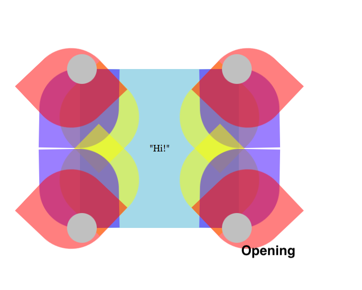
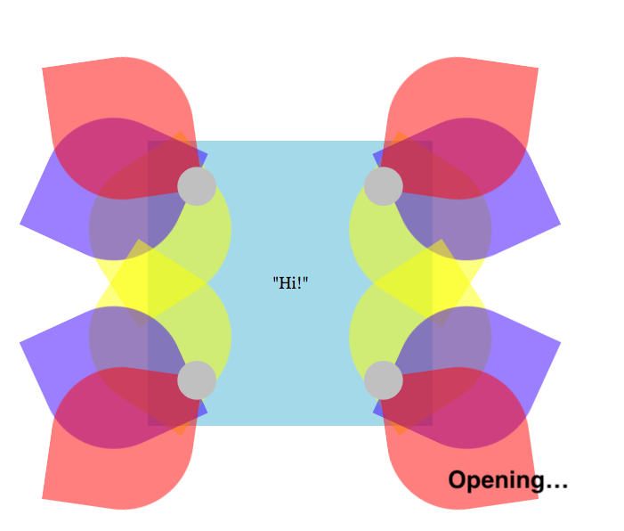
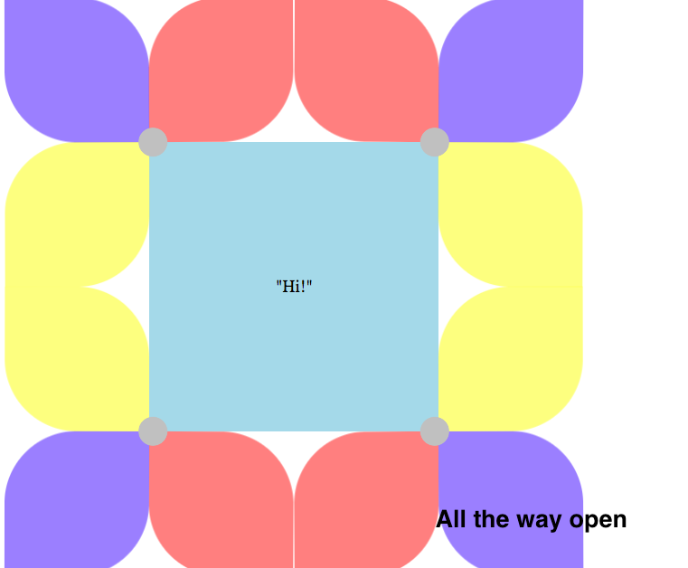

# primary_flower
This is a fun project using HTML and CSS. 
If you hover on the flower a keyframe makes the petals open and the petals appear to change colors because of their opacity. 
17 Objects move with their own keyframes. 

